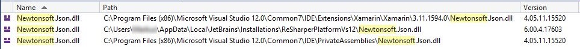

# Newtonsoft.Json Fixer

> Fixes assembly load failures when different versions of Newtonsoft.Json are installed by extensions in Visual Studio

Visual Studio ships with its own version of Newtonsoft.Json for some  
of its built-in extension. Third party extensions (such as Resharper) 
also use Newtonsoft.Json for their own purposes.

If you see package load failures from assembly mismatch exceptions, this 
extension should fix them, by providing a runtime binding redirect to 
Visual Studio unifying all versions on the most commonly used one, specified in this extension's [packages.config](https://github.com/MobileEssentials/NewtonsoftJsonFixer/blob/master/NewtonsoftJsonFixer/packages.config#L3) file.

The specific scenario this extension solves is be easy to detect:

1. Attach from a second Visual Studio instance to the running Visual Studio
   that is failing to work properly 
2. Open the Debug > Modules window and search for Newtonsoft.Json.
3. If the same assembly appears multiple times and with different versions
   then this extension will fix the issue.

